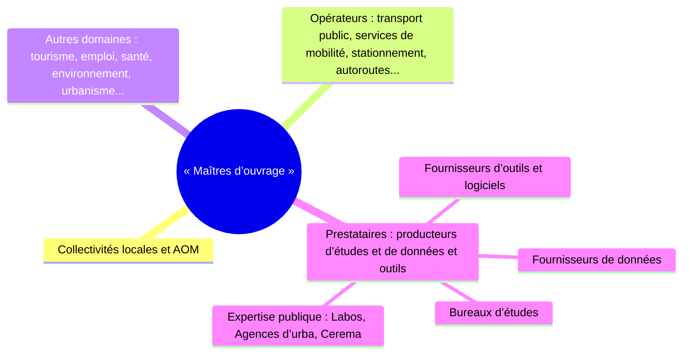

# Test Mermaid

Ce diagramme représente les acteurs de l’écosystème des mobilités et leurs rôles.

```mermaid
mindmap
  root((« Maîtres d’ouvrage »))
    Collectivités locales et AOM
    Opérateurs : transport public, services de mobilité, stationnement, autoroutes...
    Autres domaines : tourisme, emploi, santé, environnement, urbanisme...
    Prestataires : producteurs d’études et de données et outils
      Fournisseurs d’outils et logiciels
      Fournisseurs de données
      Bureaux d’études
      Expertise publique : Labos, Agences d’urba, Cerema
```

_Figure 1 : Les acteurs de l’écosystème des mobilités et leurs différents rôles._

